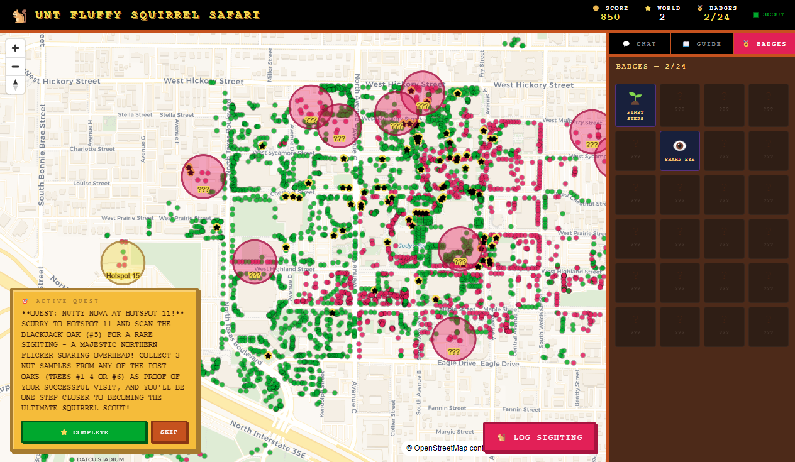
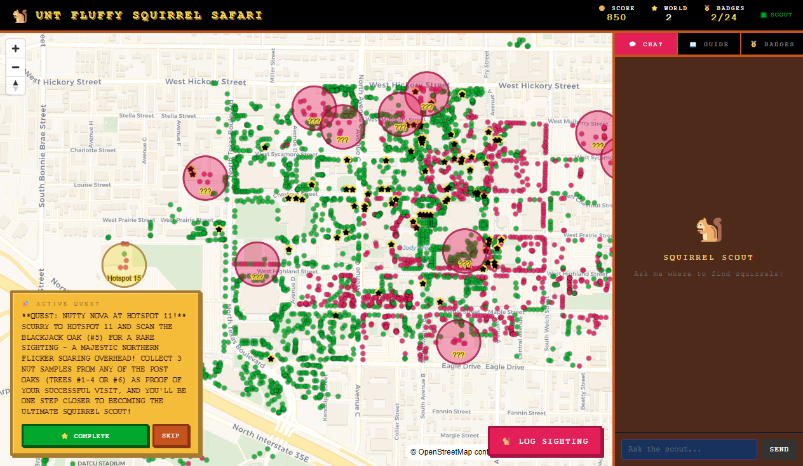
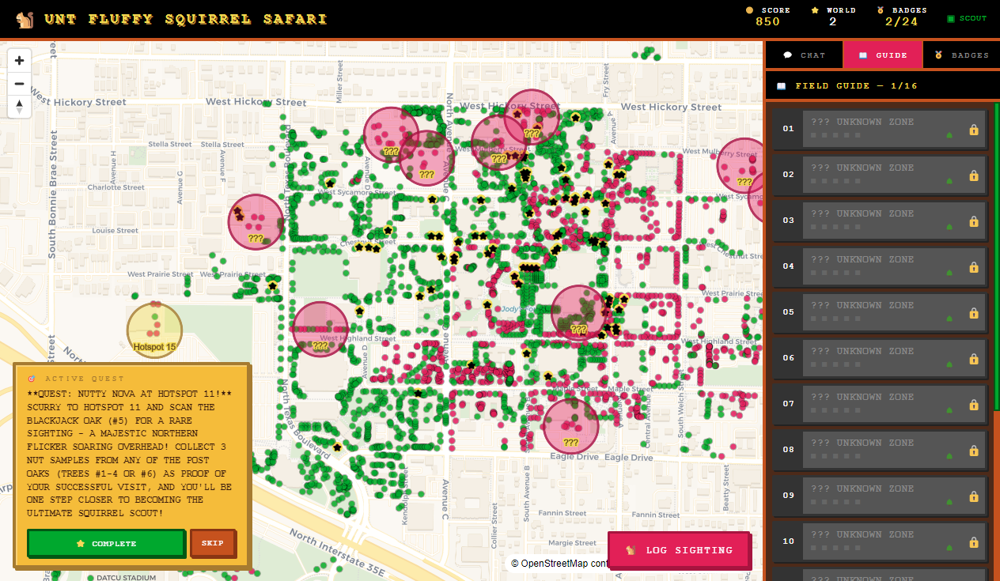

# UNT Fluffy Squirrel Safari

[](https://github.com/westondunn/unt-fluffy-squirrel-safari/actions/workflows/ci.yml)
[](https://github.com/westondunn/unt-fluffy-squirrel-safari/actions/workflows/codeql.yml)
[](https://github.com/westondunn/unt-fluffy-squirrel-safari/actions/workflows/quality-gate.yml)
[](LICENSE)

An interactive Electron desktop app that helps UNT students find squirrels on campus. Built with real UNT tree inventory data (5,000+ trees), an AI-powered "Squirrel Scout" assistant via Ollama, and a Super Mario Bros 3-inspired retro game aesthetic.

## Features

- **Interactive Campus Map** — MapLibre GL map with 5,018 UNT trees, color-coded by species
- **Squirrel Hotspots** — 16 algorithmically-computed zones where nut-producing trees cluster
- **Discovery Zones** — Visit hotspots to discover them, revealing names and species data
- **Squirrel Scout AI** — Chat with an Ollama-powered NPC that knows every tree on campus
- **AI Quests** — Dynamically generated missions to explore different parts of campus
- **Sighting Log** — Record squirrel sightings with notes and location tagging
- **24 Achievement Badges** — From "First Steps" to "Legend" (Level 20)
- **Scoring & Levels** — Earn points for discoveries, sightings, quests, and badges
- **Clickable Trees** — Tap any tree to see species, elevation, memorial status, and coordinates
- **Memorial Tree Markers** — Gold star icons highlight dedicated/memorial trees
- **Field Guide** — Pokédex-style catalog of all discovery zones with click-to-navigate

## Tech Stack

| Layer         | Technology                             |
| ------------- | -------------------------------------- |
| Desktop Shell | Electron                               |
| Frontend      | React 18 + TypeScript                  |
| Bundler       | Vite                                   |
| Map           | MapLibre GL JS + CartoDB Voyager tiles |
| Database      | SQLite via sql.js (WASM)               |
| AI            | Ollama (local or remote)               |
| Testing       | Vitest (62 tests)                      |

## Getting Started

### Prerequisites

- **Node.js** 18+
- **Ollama** (optional, for AI chat and quests) — [Install Ollama](https://ollama.ai)

### Install & Run

```bash
# Clone the repo
git clone <repo-url>
cd unt-fluffy-squirrel-safari

# Install dependencies
npm install

# Build the tree database from UNT CSV data
npm run build:db

# Build the app
npm run build          # Build renderer (Vite)
npm run build:main     # Build main process (TypeScript)

# Launch
npx electron .
```

### Enable AI Features (Optional)

The Squirrel Scout AI assistant and quest generation require Ollama:

```bash
# Install and start Ollama
ollama serve

# Pull a model (llama3.2 is the default, works great)
ollama pull llama3.2
```

The app checks `localhost:11434` on startup. The green "SCOUT" indicator in the top bar shows when connected. Without Ollama, everything works except the chat tab and AI quest generation (quests fall back to simple templates).

### Development Mode

For hot-reloading during development:

```bash
# Terminal 1: Start Vite dev server
npm run dev

# Terminal 2: Build main process and launch Electron
npm run build:main
NODE_ENV=development npx electron .
```

### Run Tests

```bash
npm test           # Run all 62 tests
npm run test:watch # Watch mode
```

### GitHub One-Click Release

Use the **Bump Version And Release** workflow in GitHub Actions:

1. Go to **Actions** -> **Bump Version And Release** -> **Run workflow**
2. Choose bump type (`patch`, `minor`, `major`) or set `custom_version`
3. Run on `main` (or your target branch)

The workflow will:

- bump `package.json` + `package-lock.json`
- commit the version bump
- create and push a `v*` tag
- automatically trigger the **Release** workflow to build and publish installer assets

If it cannot push, verify repository Action permissions allow write access and branch protection rules permit bot pushes.

### GitHub Cross-Platform Package Smoke Test

Use **Actions** -> **Package Smoke (Cross-Platform)** -> **Run workflow** to build package artifacts on:

- Windows (`nsis` installer)
- macOS (`dmg`)
- Linux (`AppImage`)

Each run uploads build artifacts so you can download and test installer output from all three systems.

## Screenshots

### Campus Map with Tree Data


_5,000+ trees plotted on the UNT campus map. Red dots = nut-producing trees (squirrel magnets), green dots = other species. Gold stars mark memorial trees. Pink circles highlight undiscovered squirrel hotspot zones._

### Badge Collection


_24 achievement badges to earn. "First Steps" for your first discovery, "Sharp Eye" for your first sighting, and 22 more challenges from "Nut Detective" to "Completionist"._

### AI-Generated Quests


_The Squirrel Scout AI generates unique quests using Ollama. Complete quests for +300 points. Score shown in the SMB3-style HUD at top._

### Field Guide


_Pokédex-style field guide with all 16 discovery zones. Click any entry to fly the map to that location. Locked zones show "???" until you discover them._

## How to Play

### Discover Zones

Click any pink hotspot circle on the map, then hit **"I'M HERE — DISCOVER ZONE"** to claim it. Each discovery earns **+100 points** and reveals the zone's name and tree data in the Field Guide.

### Log Sightings

Click **"LOG SIGHTING"** to record a squirrel sighting. Pick a zone, add notes about what you saw. Each sighting earns **+50 points**.

### Complete Quests

The AI generates unique quests based on unexplored areas. Complete them for **+300 points**. Hit SKIP to get a new quest if the current one doesn't work for you.

### Earn Badges

24 badges track your progress:

| Badge              | How to Earn                  |
| ------------------ | ---------------------------- |
| First Steps        | Discover your first zone     |
| Sharp Eye          | Log your first sighting      |
| Nut Detective      | Discover 5 zones             |
| Tree Hugger        | Discover 10 zones            |
| Campus Mapper      | Discover 50% of all zones    |
| Full Safari        | Discover all 16 zones        |
| Shutterburg        | Log 10 sightings with photos |
| Social Squirrel    | Log 25 sightings             |
| Squirrel Whisperer | Ask Scout 25 questions       |
| Questmaster        | Complete 10 quests           |
| Early Bird         | Log a sighting before 8am    |
| Night Owl          | Log a sighting after 9pm     |
| Speed Runner       | Discover 5 zones in one day  |
| Century Club       | Reach 10,000 points          |
| Legend             | Reach Level 20               |
| Completionist      | Earn all other badges        |

### Level Up

Every **500 points** = 1 level. Your level shows as "WORLD" in the top HUD bar.

## Map Legend

| Symbol           | Meaning                                                           |
| ---------------- | ----------------------------------------------------------------- |
| Red dot          | Nut-producing tree (oak, pecan, hackberry, etc.) — squirrel food! |
| Green dot        | Non-nut tree (crapemyrtle, pine, magnolia, etc.)                  |
| Gold star on dot | Memorial/dedicated tree                                           |
| Pink circle      | Undiscovered hotspot zone                                         |
| Gold circle      | Discovered hotspot zone                                           |

## Data Source

Tree data from the University of North Texas campus tree inventory — 5,053 surveyed trees with GPS coordinates, species identification, elevation, and memorial status. The build pipeline converts the CSV into a SQLite database with pre-computed hotspot clusters.

## Project Structure

```
unt-fluffy-squirrel-safari/
├── data/                    # Tree CSV + built SQLite database
├── scripts/build-db.ts      # Data pipeline: CSV -> SQLite
├── src/
│   ├── main/                # Electron main process
│   │   ├── db.ts            # SQLite database layer
│   │   ├── game-engine.ts   # Scoring, badges, quests
│   │   ├── ollama.ts        # AI client
│   │   └── ipc.ts           # IPC bridge
│   ├── preload/             # Electron preload (context bridge)
│   ├── renderer/            # React frontend
│   │   ├── components/      # MapView, TopBar, Sidebar, etc.
│   │   └── hooks/           # useGameState, useOllama
│   └── shared/types.ts      # Shared TypeScript types
└── tests/                   # Vitest test suites (62 tests)
```

## License

MIT
